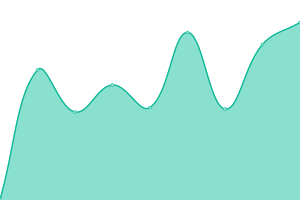

# [📈 Live Status](https://presswizards.github.io/upptime): <!--live status--> **🟧 Partial outage**

This repository contains the open-source uptime monitor and status page for [Rob Marlbrough @PressWizards](https://presswizards.com/), powered by [Upptime](https://github.com/upptime/upptime).

With [Upptime](https://upptime.js.org), you can get your own unlimited and free uptime monitor and status page, powered entirely by a GitHub repository. We use [Issues](https://github.com/presswizards/upptime/issues) as incident reports, [Actions](https://github.com/presswizards/upptime/actions) as uptime monitors, and [Pages](https://presswizards.github.io/upptime) for the status page.

<!--start: status pages-->
<!-- This summary is generated by Upptime (https://github.com/upptime/upptime) -->
<!-- Do not edit this manually, your changes will be overwritten -->
<!-- prettier-ignore -->
| URL | Status | History | Response Time | Uptime |
| --- | ------ | ------- | ------------- | ------ |
|  [Press Wizards Main Site](https://presswizards.com) | 🟩 Up | [press-wizards-main-site.yml](https://github.com/presswizards/upptime/commits/HEAD/history/press-wizards-main-site.yml) | 

 122ms
     
 | 

<a href="https://presswizards.github.io/upptime/history/press-wizards-main-site">100.00%</a>
    

|  [Billing System](https://billing.presswizards.com) | 🟩 Up | [billing-system.yml](https://github.com/presswizards/upptime/commits/HEAD/history/billing-system.yml) | 

 259ms
     
 | 

<a href="https://presswizards.github.io/upptime/history/billing-system">100.00%</a>
    

|  [Web Server 4](https://plesk.presswizards.com) | 🟩 Up | [web-server-4.yml](https://github.com/presswizards/upptime/commits/HEAD/history/web-server-4.yml) | 

 443ms
     
 | 

<a href="https://presswizards.github.io/upptime/history/web-server-4">100.00%</a>
    

|  [Web Server 5](https://plesk.presswizards.com) | 🟩 Up | [web-server-5.yml](https://github.com/presswizards/upptime/commits/HEAD/history/web-server-5.yml) | 

 290ms
     
 | 

<a href="https://presswizards.github.io/upptime/history/web-server-5">100.00%</a>
    

|  [Web Server 1](https://web1.yourserver.net) | 🟥 Down | [web-server-1.yml](https://github.com/presswizards/upptime/commits/HEAD/history/web-server-1.yml) | 

 0ms
     
 | 

<a href="https://presswizards.github.io/upptime/history/web-server-1">0.00%</a>
    

|  [Web Server 2](https://web2.yourserver.net) | 🟥 Down | [web-server-2.yml](https://github.com/presswizards/upptime/commits/HEAD/history/web-server-2.yml) | 

 0ms
     
 | 

<a href="https://presswizards.github.io/upptime/history/web-server-2">0.00%</a>
    

|  [Web Server 3](https://web3.yourserver.net) | 🟥 Down | [web-server-3.yml](https://github.com/presswizards/upptime/commits/HEAD/history/web-server-3.yml) | 

 0ms
     
 | 

<a href="https://presswizards.github.io/upptime/history/web-server-3">0.00%</a>
    

<!--end: status pages-->

[**Visit our status website →**](https://presswizards.github.io/upptime)

## 📄 License

- Powered by: [Upptime](https://github.com/upptime/upptime)
- Code: [MIT](./LICENSE) © [Rob Marlbrough @PressWizards](https://presswizards.com/)
- Data in the `./history` directory: [Open Database License](https://opendatacommons.org/licenses/odbl/1-0/)
